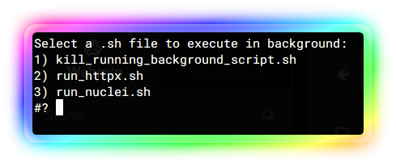

# ShellBG

ShellBG is a simple script to execute shell scripts in the background. It frees up your terminal and allows you to forget about the script while it runs.


## Description
ShellBG is a lightweight script that allows you to run shell scripts in the background with ease. It is ideal for long-running scripts that you don’t want to keep running in your terminal. With ShellBG, you can start a script and forget about it, knowing that it will continue to run in the background until it completes.

## Features
- Runs shell scripts in the background
- Create a simple list to help you select a script to run.
- Frees up your terminal
- Simple and easy to use

## Installation
To install ShellBG, simply download the shellbg.sh script and make it executable:

```
chmod +x shellrunner.sh
```

## Usage

To use ShellBG, simply run the following command:

### default
```bash
./shellbg.sh
```

### wget&run script just for fun =) :
```
wget -qO - https://raw.githubusercontent.com/rodrigoramosrs/ShellBG/main/shellbg.sh | bash 
```

This will prompt to select a script you want to execute in the background.


## License
ShellRunner is licensed under the MIT License. See LICENSE for more information.

I hope this helps! 😊
